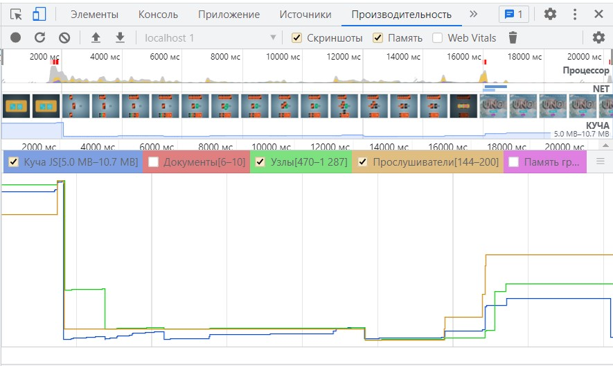

## Поиск утечек памяти

Анализ проводился в devtools браузера.

### Вкладка Performance
 
При взаимодействии пользователя с игрой память растёт, но после сборки мусора сбрасывается до минимума.

### Вкладка Memory
 
Снимки сделаны:
1. при загрузке главной страницы
2. при загрузке страницы с игрой
3. после раздачи карт
4. в произвольный момент игры
5. на финише, когда показывается модальное окно
6. после запуска игры без выхода со страницы игры
7. при переходе на главную страницу
 
Показатель памяти при этом не скачет и не показывает постоянный рост после взаимодействия с приложением. Показатель памяти приблизительно одинаковый.

### Итог:
Утечки памяти не обнаружены
