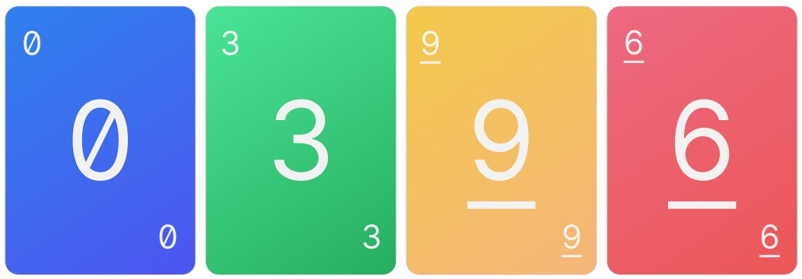
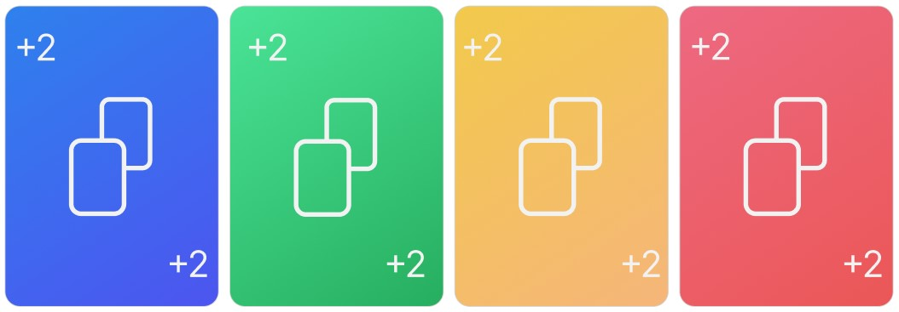
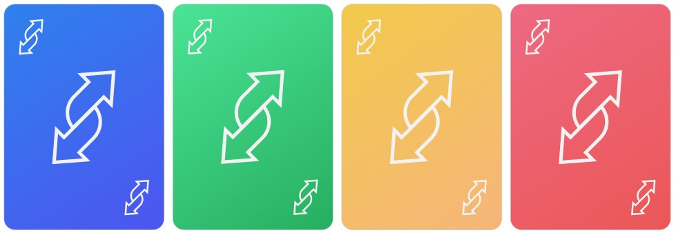
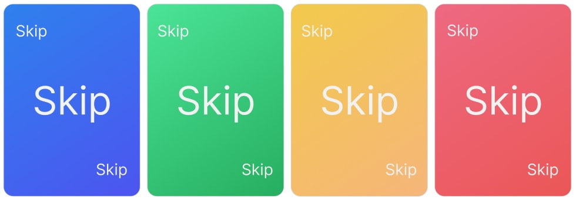
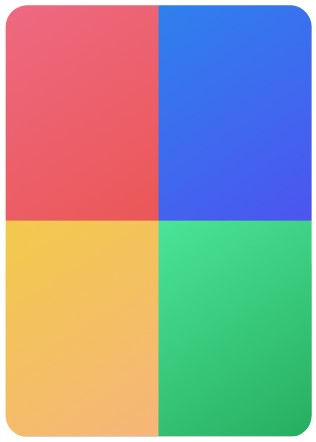

# Правила веб-игры UNO

## Цель игры
Каждый участник в начале игры получает в ["руку"](#рука) 7 карт. Чтобы победить, нужно избавиться от всех карт на ["руке"](#рука). Первый участник, сбросивший последнюю карту с ["руки"](#рука), станет победителем. !!!А карты соперников суммируются в [призовые очки](#очки-за-карты).

## Карты в игре
* Всего карт - 108
<!-- Добавить картинки для карт? -->
<!-- Добавить плашки каждого цвета -->
* Цветные карты:
    * От 1 до 9 - по две карты каждого цвета с каждой цифрой
    * 0 - по одной карте каждого цвета
* Цветные карты с особыми правилами:
    * "вытяни две" (+2) - по две карты каждого цвета
    * "смена направления" - по две карты каждого цвета
    * "пропусти ход" - по две карты каждого цвета
* Специальные карты:
    * "дикая карта" - всего 4 карты
    * "дикая карта + вытяни четыре" - всего 4 карты

## Пояснения к картам
#### Карты с цифрами от 0 до 9:
Такую карту можно выложить из ["руки"](#рука) только при соответствии верхней карте [колоды сброса](#колода-сброса) по цифре или по цвету. 
 

#### Карты "вытяни две":
Карту "вытяни две", как и карту с цифрой, можно выложить только при соответствии верхней карте [колоды сброса](#колода-сброса) по цвету или по значению (то есть если в [колоде сброса](#колода-сброса) верхняя карта "вытяни две" такого же или другого цвета).
Особое правило: следующий по очереди игрок за игроком, который выложил карту "вытяни две", получает две карты из [закрытой колоды](#закрытая-колода) и пропускает ход. 
 

#### Карты "смена направления":
Карту "смена направления", как и карту с цифрой, можно выложить только при соответствии верхней карте [колоды сброса](#колода-сброса) по цвету или по значению (то есть если в [колоде сброса](#колода-сброса) верхняя карта "смена направления" такого же или другого цвета).
Особое правило: направление очерёдности хода меняется в обратную сторону. 
 

#### Карты "пропусти ход":
Карту "пропусти ход", как и карту с цифрой, можно выложить только при соответствии верхней карте [колоды сброса](#колода-сброса) по цвету или по значению (то есть если в [колоде сброса](#колода-сброса) верхняя карта "пропусти ход" такого же или другого цвета).
Особое правило: следующий по очереди игрок за игроком, который выложил карту "пропусти ход", пропускает свй ход. 
 

#### "Дикая карта":
Такую карту можно выложить в любой свой ход независимо от верхней карты в [колоде сброса](#колода-сброса).
Особое правило: игрок, который выложил такую карту, должен выбрать цвет, с которым продолжится игра, то есть следующий игрок сможет сделать свой ход любой картой выбранного цвета, либо специальной картой. Цвет можно выбрать любой из четырех включая тот, что был последним. 
 

#### "Дикая карта + вытяни четыре":
Такую карту можно выложить только в том случае, если больше нечем совершить ход.
Особое правило: игрок так же, как в правиле "дикой карты" должен ввыбрать цвет, но в дополнение к этому следующий по очереди игрок получает из [закрытой колоды](#закрытая-колода) четыре карты и пропускает свой ход. 

## Процесс игры
#### Начало игры:
- Всем игрокам раздаётся по 7 карт, а одна карта из [закрытой колоды](#закрытая-колода) выкладывается в открытую. Игрок, который ходит первым, должен совершить свой ход в зависимости от открытой карты.

#### Ходы игроков:
- Игроки по очереди должны выложить с ["руки"](#рука) по одной карте. Если есть подходящая карта, взять из [закрытой колоды](#закрытая-колода) не получится.
- Если в ["руке"](#рука) не оказывается ни одной подходящей карты, игрок должен взять одну карту из [закрытой колоды](#закрытая-колода). Если же эту карту можно выложить, игрок должен это сделать. После чего ход переходит к следующему игроку.
- ***Если игрок выкладывая карту остаётся с одной картой в ["руке"](#рука), необходимо сообщить об этом остальным игрокам, нажав на кнопку "UNO" до совершения хода другим игроком.*** В случае, если оставшийся с одной картой игрок не нажмёт на кнопку, то он получает штрафные две карты из [закрытой колоды](#закрытая-колода) в ["руку"](#рука).

#### Завершение игры:
- Когда один из игроков сбрасывает последнюю карту с ["руки"](#рука), игра завершается, [очки](#очки-за-карты) за карты соперников суммируются и добавляются в рейтинг победителя.

## Очки за карты
При подсчёте очков цвет никак не влияет на ценность карты.
#### Стоимость карт с цифрами соответствует цифре карты:
* 0 - ноль очков
* 1 - одно очко
* 2 - два очка
* 3 - три очка
* 4 - четыре очка
* 5 - пять очков
* 6 - шесть очков
* 7 - семь очков
* 8 - восемь очков
* 9 - девять очков

#### Цветные карты с особыми правилами имеют одинаковую стоимость:
* ["вытяни две"](#карты-вытяни-две) - двадцать очков
* ["смена направления"](#карты-смена-направления) - двадцать очков
* ["пропусти ход"](#карты-пропусти-ход) - двадцать очков

#### Специальные карты в игре дают преимущество перед другими игроками, поэтому они самые дорогие:
* ["дикая карта"](#дикая-карта) - пятьдесят очков
* ["дикая карта + вытяни четыре"](#дикая-карта--вытяни-четыре) - пятьдесят очков

## Термины
#### закрытая колода
\- колода карт, из которой игроки берут карты в ["руку"](#рука);
#### колода сброса
\- колода, в которую игроки складывают сбрасываемые с ["руки"](#рука) карты в открытую (то есть "рубашкой вниз"); после окончания карт в [закрытой колоде](#закрытая-колода), карты из колоды сброса перемешиваются и переносятся в [закрытую колоду](#закрытая-колода);
#### "рука"
\- карты игрока;
